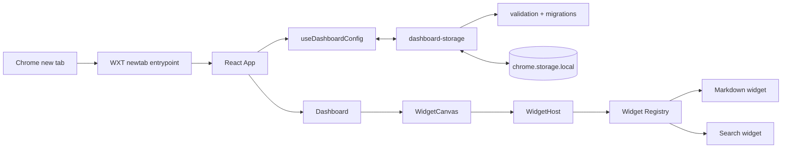

# Architecture

## System Flow



`entrypoints/newtab/main.tsx` mounts `App` and loads global/Tailwind and grid
styles. `App` is the composition root: it resolves appearance, applies the theme
to the document, surfaces persistence errors, and connects state operations to
`Dashboard`.

## Module Boundaries

| Layer                   | Responsibility                                                               |
| ----------------------- | ---------------------------------------------------------------------------- |
| `components/dashboard/` | Ephemeral edit/dialog state, grid interaction, widget hosting                |
| `components/ui/`        | Domain-free accessible primitives and shared favicon wrapper                 |
| `widgets/`              | Typed definitions, factories, renderer/editor behavior, domain helpers       |
| `storage/`              | Persistent schema boundary, defaults, validation, migrations, WXT repository |
| `hooks/`                | React state, debouncing, write ordering, lifecycle flushes                   |

UI does not access Chrome storage directly. Storage does not depend on React.
Renderer-derived state is not persisted.

## Configuration and Registry

`storage/schema.ts` defines `DashboardConfig` version 2 and maps widget type
literals to concrete configs through `WidgetConfigMap`. Each config contains an
ID, type, optional title, and `{x,y,w,h}` layout; Markdown adds `content`, Search
adds `engine`.

`widgets/registry.tsx` is the only widget integration point. A definition owns:

- metadata and factory;
- runtime type guard;
- renderer and optional editor;
- card/bare chrome and inline/dialog editor presentation;
- title behavior and dialog size;
- per-type layout constraints and resize handles.

`WidgetHost` asks the registry to render/edit a config and shows a safe fallback
for unknown types. Adding a widget type requires updating the config map,
storage validation, registry definition, factory, renderer/editor, and tests.
Increase the schema version only when persisted compatibility requires it.

## State and Persistence

`storage/dashboard-storage.ts` owns the WXT item `local:dashboard-config`.
Loading reads `unknown`, calls `migrateDashboardConfig`, and writes back any
migrated/normalized object. Saving validates through the same boundary.

Current migration behavior:

- v1 `links` becomes v2 `markdown`, preserving ID, title, content, and layout;
- current and legacy SearchWidget layouts are normalized to `h: 1`;
- malformed and unsupported/future versions throw explicit errors.

`useDashboardConfig` keeps state plus a synchronous ref so rapid updates compose
against the latest config. Add/remove, appearance, and completed layout changes
save immediately. Widget/editor changes use a 300 ms debounce. Saves are queued
to prevent an older slow write from overwriting newer state; pending widget
changes flush on editor finish, Escape, `pagehide`, and unmount.

## Dashboard Layout

`dashboard-layout.ts` converts domain layouts to/from `react-grid-layout` and
applies registry constraints. The grid has 12 columns, 48 px rows, and 16 px
gaps. Markdown defaults to `4×3` with minimum `3×3`; Search defaults to `6×1`,
minimum width 3, fixed height 1, and east-only resize.

Dragging/resizing is edit-mode-only. The no-compaction strategy blocks
collisions but preserves explicit coordinates. Dragging is intentionally
unbounded vertically so empty rows below the current content remain reachable
and the canvas can grow. Interactive controls are excluded from the drag
gesture. At viewport widths below 960 px, the canvas scrolls horizontally
instead of transforming persisted layouts.

## Markdown Widget

`MarkdownWidget.content` is the sole source of truth. `MarkdownRenderer` uses:

```text
Markdown -> remark-gfm -> rehype-raw -> rehype-sanitize -> React components
```

The sanitizer admits the required structural/formatting subset (including
tables, `details`, `summary`, `mark`, `kbd`, `sub`, `sup`, and `ins`) and removes
executable/embedded/form content, event attributes, arbitrary class/style data,
and unsafe URLs. React rendering does not use `dangerouslySetInnerHTML`.

Component overrides enforce HTTP/HTTPS links and absolute HTTPS images again.
Links stay in the current tab and use Chrome's local `_favicon` via
`SiteFavicon`; images are lazy, async-decoded, bounded, and `no-referrer`.
Fenced code is unhighlighted, horizontally scrollable, and copyable.

Task-list interaction uses the list item's AST source offset to toggle the exact
`[ ]`/`[x]` marker in source text. The fullscreen editor owns only ephemeral
split state (50/50 on each open, keyboard/pointer range 30–70) and sends title
and content changes through the normal debounced persistence path.

## Search Widget

Search is intentionally a bare form with no visible card or title. Engine
definitions in `widgets/search/engines.ts` contain fixed HTTPS action, query
parameter (`q`, or Yandex `text`), label, and bundled icon path. The native GET
form has no target, so explicit submission replaces the current new tab. Empty
queries are prevented; trimmed query text remains form-only and is never stored.

The icon URL is resolved with `browser.runtime.getURL`. Each local 32×32 CoreUI
Brands SVG renders at 24×24 inside a white 40×40 button; a black outline
magnifier is the load-error fallback. Chrome `_favicon` is not used for search
brands and remains enabled only for user Markdown links.

## Extension Boundary

`wxt.config.ts` is the manifest source. The only permissions are `storage` and
`favicon`; no host permissions exist. Static assets in `public/` are bundled,
and generated `.wxt/` and `.output/` directories are never source files.
