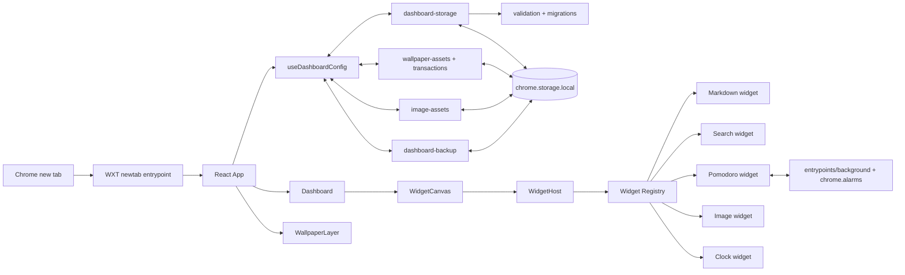

# Architecture

## System Flow



`entrypoints/newtab/main.tsx` mounts `App` and loads global/Tailwind and grid
styles. `App` is the composition root: it resolves appearance, applies the theme
to the document, surfaces persistence errors, and connects state operations to
`Dashboard`.

## Module Boundaries

| Layer                   | Responsibility                                                               |
| ----------------------- | ---------------------------------------------------------------------------- |
| `components/dashboard/` | Ephemeral edit/dialog state, grid interaction, widget hosting                |
| `components/ui/`        | Domain-free accessible primitives and shared favicon wrapper                 |
| `widgets/`              | Typed definitions, factories, renderer/editor behavior, domain helpers       |
| `storage/`              | Persistent schema boundary, defaults, validation, migrations, WXT repository |
| `hooks/`                | React state, debouncing, write ordering, lifecycle flushes                   |

UI does not access Chrome storage directly. Storage does not depend on React.
Renderer-derived state is not persisted.

## Configuration and Registry

`storage/schema.ts` defines `DashboardConfig` version 5 and maps widget type
literals to concrete configs through `WidgetConfigMap`. Each config contains an
ID, type, optional title, and `{x,y,w,h}` layout; Markdown adds `content`, Search
adds `engine`, Pomodoro adds duration and sound settings, Image adds `source`,
`objectPosition`, and optional `altText`, and Clock adds `timeFormat`, `showTime`,
`showSeconds`, `showDate`, `dateFormat`, `showDayOfWeek`, `timezone`,
`showTimezoneName`, and `showTimezoneAbbr`.

`widgets/registry.tsx` is the only widget integration point. It dynamically
loads each widget renderer when that widget is mounted and loads its editor only
when editing begins. A definition owns:

- metadata and factory;
- runtime type guard;
- renderer and optional editor;
- card/bare chrome and inline/dialog editor presentation;
- title behavior and dialog size;
- per-type layout constraints and resize handles.

`WidgetHost` asks the registry to render/edit a config and shows a safe fallback
for unknown types. Adding a widget type requires updating the config map,
storage validation, registry definition, factory, renderer/editor, and tests.
Increase the schema version only when persisted compatibility requires it.

## Command Palette

`components/dashboard/command-catalog.ts` derives typed commands from the
current in-memory config, widget registry, and theme registry. Search performs
case-insensitive substring matching; neither the catalog nor query is stored.
`CommandPalette` owns only dialog, query, selection, and theme-list state. It
uses the shared `Dialog` launcher variant: top-centered 480 px search field,
results below it, subtle backdrop, screen-reader-only title, and a narrow-
viewport offset below the toolbar. Closed search remains visually absent.
`DashboardControls` executes commands through existing Dashboard callbacks.
Widget focus uses the rendered card's `data-widget-id` and temporary focus.
`widgets/markdown/extract-links.ts` parses saved Markdown with `remark-parse`
and `remark-gfm`, then validates candidate URLs with the same `normalizeLinkUrl`
rule as the renderer. No Chrome bookmarks access or permission is used.
`download-backup.ts` shares the Blob download between the backup dialog and
direct export command; both call the same queued backup export hook.

## State and Persistence

`storage/dashboard-storage.ts` owns the WXT item `local:dashboard-config`.
Loading reads `unknown`, calls `migrateDashboardConfig`, and writes back any
migrated/normalized object. Saving validates through the same boundary.

Current migration behavior:

- v1 `links` becomes `markdown`, preserving ID, title, content, and layout;
- v1 and v2 appearance data gains `{type: 'none'}` wallpaper state;
- v1, v2, and v3 gain the default `liquidGlass` group when migrated to v5;
- v4 keeps `liquidGlassEnabled` while migrating it into the v5 group and gains
  standard transparency, blur, and shadow values;
- retired WIP `google-calendar` widgets are removed from v2 while all supported
  widgets and appearance data are preserved;
- current and legacy SearchWidget layouts are normalized to `h: 1`;
- malformed and unsupported/future versions throw explicit errors.

`useDashboardConfig` keeps state plus a synchronous ref so rapid updates compose
against the latest config. Add/remove, ordinary appearance, and completed layout
changes save immediately. Liquid Glass sliders update React state for live
preview and persist after pointer/keyboard completion, blur, dialog close,
`pagehide`, or unmount. Widget/editor changes use a 300 ms debounce. Saves are
queued to prevent an older slow write from overwriting newer state; pending
widget changes flush on editor finish, Escape, `pagehide`, and unmount.

Backup export and import use the same serialized operation queue. Export first
flushes pending widget and appearance changes, then snapshots the current
validated config and referenced local wallpaper. Import validates and prepares
the complete backup before it joins the queue, so older queued saves always
finish before the replacement commit.

## Backup Format and Restore

`storage/dashboard-backup.ts` owns the JSON wire format independently of the
persisted dashboard schema. Format v2 contains the marker
`chrome-start-page-backup`, `formatVersion: 2`, an ISO export timestamp, a
`DashboardConfig`, the referenced `LocalWallpaperAssetV1` or `null`, and
an array of `localImages: LocalWallpaperAssetV1[]`. Format v1 backups without
`localImages` remain fully supported and restore cleanly. Only this envelope
is accepted; nested dashboard data still passes through the normal migration boundary.

Local wallpaper and image data are decoded, checked against config asset IDs, and
browser-validated before any write. Import assigns fresh UUIDs to all local
assets, saves the new assets before the replacement config, rolls them back if
the config write fails, and removes previous assets only after commit. Non-local
imports save the replacement config before removing any previous local assets.
A cleanup failure is reported as a warning without rolling back an already valid
import. HTTPS wallpaper and remote images remain URLs and are revalidated before
commit.

The dashboard backup dialog performs file selection and Blob download but never
accesses extension storage directly. Browser-native Blob/object URLs avoid a
`downloads` permission. Closing the dialog aborts validation; once the queued
storage transaction begins it is allowed to finish atomically.

## Wallpaper Pipeline

`AppearanceConfig.wallpaper` is a discriminated union: no wallpaper, an HTTPS
URL, or a local asset UUID. Remote URLs are validated by browser image loading
without broad host permissions or an extension `fetch`. Local files support
PNG, JPEG, WebP, GIF, AVIF, and SVG; signatures/content and browser decoding are
checked before the persisted config changes.

Local bytes are stored separately through `storage/wallpaper-assets.ts` under
`local:dashboard-wallpaper:<uuid>`. Files at or below 6 MiB remain byte-for-byte
unchanged. Larger files are gzip-compressed only when the lossless result fits
within 6 MiB; otherwise the original is retained under `unlimitedStorage`.
`storage/wallpaper-transactions.ts` saves the new asset and config before
removing the old asset, rolls a new asset back on config failure, and cleans up
orphaned wallpaper keys on startup.

`useWallpaperImage` decodes and revalidates local assets before creating a Blob
URL, revoking it on replacement/unmount. `WallpaperLayer` is a decorative fixed
layer behind the dashboard and uses centered `object-cover`, so it fills the
viewport and crops overflow. Failed validation leaves the previous wallpaper
intact and is surfaced in the appearance dialog.

## Dashboard Layout

`dashboard-layout.ts` converts domain layouts to/from `react-grid-layout` and
applies registry constraints. The grid has 12 columns, 48 px rows, and 16 px
gaps. Markdown defaults to `4×3` with minimum `3×3`; Search defaults to `6×1`,
minimum width 3, fixed height 1, and east-only resize.

Dragging/resizing is edit-mode-only. The no-compaction strategy blocks
collisions but preserves explicit coordinates. Dragging is intentionally
unbounded vertically so empty rows below the current content remain reachable
and the canvas can grow. Interactive controls are excluded from the drag
gesture. At viewport widths below 960 px, the canvas scrolls horizontally
instead of transforming persisted layouts.

## Markdown Widget

`MarkdownWidget.content` is the sole source of truth. `MarkdownRenderer` uses:

```text
Markdown -> remark-gfm -> rehype-raw -> rehype-sanitize -> React components
```

The sanitizer admits the required structural/formatting subset (including
tables, `details`, `summary`, `mark`, `kbd`, `sub`, `sup`, and `ins`) and removes
executable/embedded/form content, event attributes, arbitrary class/style data,
and unsafe URLs. React rendering does not use `dangerouslySetInnerHTML`.

Component overrides enforce HTTP/HTTPS links and absolute HTTPS images again.
Links stay in the current tab and use Chrome's local `_favicon` via
`SiteFavicon`; images are lazy, async-decoded, bounded, and `no-referrer`.
Fenced code is unhighlighted, horizontally scrollable, and copyable.

Task-list interaction uses the list item's AST source offset to toggle the exact
`[ ]`/`[x]` marker in source text. The fullscreen editor owns only ephemeral
split state (50/50 on each open, keyboard/pointer range 30–70) and sends title
and content changes through the normal debounced persistence path.

## Search Widget

Search is intentionally a bare form with no visible card or title. Engine
definitions in `widgets/search/engines.ts` contain fixed HTTPS action, query
parameter (`q`, or Yandex `text`), label, and bundled icon path. The native GET
form has no target, so explicit submission replaces the current new tab. Empty
queries are prevented; trimmed query text remains form-only and is never stored.

The icon URL is resolved with `browser.runtime.getURL`. Each local 32×32 CoreUI
Brands SVG renders at 24×24 inside a white 40×40 button; a black outline
magnifier is the load-error fallback. Chrome `_favicon` is not used for search
brands and remains enabled only for user Markdown links.

## Liquid Glass

Статический Liquid Glass применяется только к поверхностям Markdown и Search.
Состояние и параметры хранятся в `appearance.liquidGlass`: переключатель,
прозрачность `0–100%`, размытие `0–40 px` и тень `0–100%`. Стандартные значения
`40% / 18 px / 50%` можно восстановить отдельной кнопкой без изменения
переключателя. Настройки находятся в закрытом разделе «Виджеты» окна
оформления.

`App` добавляет корневой класс `liquid-glass-enabled` и преобразует числа в CSS
custom properties. Theme-aware формулы используют их для tint, blur и внешней
тени, а виджеты используют семантические классы поверхностей без передачи
визуальных параметров через всё дерево Dashboard.

При выключении Markdown возвращается к непрозрачной карточке, а Search — к
прежнему bare-виду без внешней капсулы. Стили учитывают светлую и тёмную тему;
при отсутствии `backdrop-filter` полупрозрачный фон, рамка и тень остаются
доступным fallback. Панели управления и диалоги эффект не используют. Новые
зависимости и разрешения расширения не требуются.

## Pomodoro Widget

Pomodoro is a card widget (`3×5`, min `3×4`) supporting customizable focus and
break intervals (work, short break, long break) and cycle-based progression.
While configuration (durations, long break interval, sound toggle) is part of
`DashboardConfig`, dynamic timer runtime state (`status`, `phase`,
`targetEndTime`, `remainingSeconds`, `cycleCount`, `completedToday`,
`lastResetDate`) is isolated in WXT Storage under `local:pomodoro-state:<id>`.

This runtime separation ensures tabs synchronize in real-time via storage
events without triggering dashboard saves or conflicting with the serialized
save queue. A background service worker (`entrypoints/background.ts`) listens
for `chrome.alarms`, fires system notifications (`chrome.notifications`) upon
interval completion even when start page tabs are closed, advances the
timer phase, and plays audio via an offscreen document (`entrypoints/offscreen.html`).
Active tabs additionally play a local Web Audio chime if open.

## Theme System and Design Tokens

The theme architecture lives in `themes/` and decouples color palettes and
visual tokens from widget logic and components:

- `themes/types.ts` defines `ThemeId` (11 themes: `system`, `light`, `dark`,
  `tokyo-night`, `rainy-tokyo`, `cozy-lofi-night`, `catppuccin-mocha`,
  `catppuccin-latte`, `nord`, `synthwave-84`, `solarized-dark`),
  `ThemeTokens`, `ThemeDefinition`, and `ThemePreviewColors`.
- `themes/palettes.ts` provides complete, high-contrast token definitions for all
  10 palettes (background, surface, surface-card, borders, primary/muted text,
  accents, badges, states, scrollbar colors, and optional glow properties).
- `themes/registry.ts` exposes `THEMES: readonly ThemeDefinition[]`,
  `getThemeDefinition(id)`, and `resolveTheme(id, systemDarkMode)`.
- `entrypoints/newtab/themes.css` declares scoped CSS variables
  (`--theme-bg`, `--theme-surface`, `--theme-accent`, etc.) via
  `:root, [data-theme="..."]` selectors.
- `entrypoints/newtab/style.css` defines the Tailwind CSS 4 `@theme` block
  mapping semantic utility classes (`bg-theme-surface`, `text-theme-text-primary`,
  `border-theme-border`, `bg-theme-accent`) to these custom properties. It also
  defines `.theme-glow` for retro/synthwave effects and scrollbar styling via
  `color-mix`.
- `App.tsx` calls `resolveTheme` to synchronously set `data-theme`, `color-scheme`,
  and the `.dark` class on the root container.
- `AppearanceDialog.tsx` displays an interactive grid of theme preview cards with
  swatches for background, card surface, and accent color. Selecting a preset
  automatically resets `backgroundColor` to the theme's curated default while
  leaving manual color-picker overrides accessible.

## Extension Boundary

`wxt.config.ts` is the manifest source. Permissions are `storage`,
`unlimitedStorage`, `favicon`, `alarms`, `notifications`, and `offscreen`; no host
permissions exist. Static assets in `public/` are bundled, and generated
`.wxt/` and `.output/` directories are never source files.
