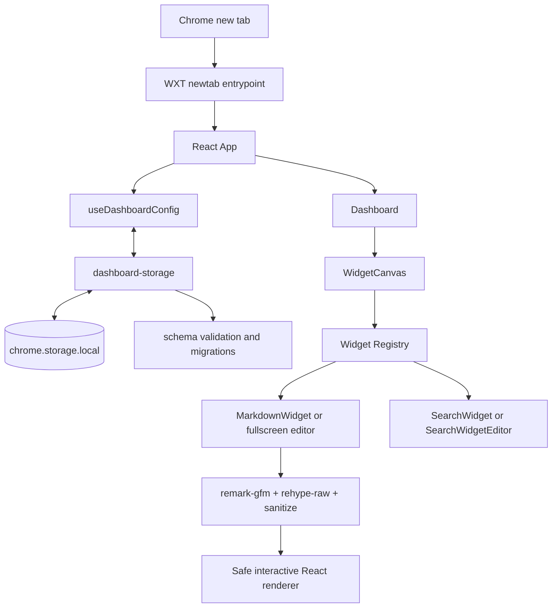

# Архитектура Chrome Start Page

Документ описывает MVP версии 0.1.0 и фактические границы модулей проекта.

## Общий поток



`DashboardConfig` движется между UI и storage как единый типизированный объект.
Компоненты не обращаются к Chrome API напрямую, а storage не зависит от React.

## WXT newtab entrypoint

`entrypoints/newtab/index.html` и `main.tsx` образуют WXT entrypoint типа
`newtab`. WXT генерирует поле `chrome_url_overrides.newtab` в Manifest V3.
`main.tsx` подключает стили Tailwind и `react-grid-layout`, после чего монтирует
`App` в React Strict Mode.

Конфигурация manifest находится в `wxt.config.ts`: имя, версия, описание,
иконки и разрешения задаются в одном месте. Статические файлы из `public/`
копируются в extension build.

## App и Dashboard

`App` — composition root React-части. Он:

- получает конфигурацию через `useDashboardConfig`;
- разрешает тему `system` в `light` или `dark` через `useSystemDarkMode`;
- применяет тему к корневому элементу документа;
- передаёт данные и операции в `Dashboard`;
- показывает ошибку загрузки или сохранения с ролью `alert`.

`Dashboard` хранит только эфемерное UI-состояние: включён ли режим
редактирования и какой виджет сейчас редактируется. Persisted state остаётся в
`DashboardConfig`. `DashboardControls` управляет режимом редактирования,
добавлением виджета и appearance, а `WidgetCanvas` отвечает за размещение,
редактирование и удаление экземпляров виджетов.

## Модель конфигурации

Корневая схема определена в `storage/schema.ts`:

```ts
interface DashboardConfig {
  version: 2;
  widgets: WidgetConfig[];
  appearance: AppearanceConfig;
}
```

Каждый виджет расширяет `BaseWidgetConfig` с `id`, discriminant `type`,
необязательным `title` и `layout`. `WidgetConfigMap` связывает строковый тип с
конкретной конфигурацией:

```ts
interface WidgetConfigMap {
  markdown: MarkdownWidgetConfig;
  search: SearchWidgetConfig;
}

type WidgetType = keyof WidgetConfigMap;
type WidgetConfig = WidgetConfigMap[WidgetType];
```

Такой подход формирует typed discriminated union без `any`. После добавления
нового свойства в `WidgetConfigMap` TypeScript проверяет места, работающие со
всеми типами виджетов.

## Widget Registry

`widgets/registry.tsx` связывает тип виджета с:

- metadata для диалога добавления;
- factory начальной конфигурации;
- runtime type guard;
- renderer;
- необязательным editor;
- правилом, разрешающим завершить редактирование;
- presentation-параметрами: карточка или безрамочное представление, inline- или
  dialog-editor, обычный или полноэкранный диалог, стиль заголовка, возможность
  пользовательского заголовка и индивидуальные ограничения layout/resize;
- callback для изменений конфигурации непосредственно из renderer — например,
  при клике по task-list checkbox.

UI получает доступные типы через `getAvailableWidgetDefinitions`, создаёт
экземпляр через `createWidgetConfig` и отображает его через найденный
definition. Неизвестный или некорректный тип не приводит к выполнению
произвольного компонента: registry возвращает `undefined` или `null`, а
`WidgetHost` показывает безопасный fallback.

## MarkdownWidget

`MarkdownWidgetConfig` добавляет к базовым полям строку `content`. Исходный
Markdown — единственный source of truth; AST и HTML в storage не сохраняются.
Новый экземпляр имеет размер 4×3 и минимум 3×3. Карточка содержит отдельный
фиксированный заголовок размером 20 px, а прокрутка ограничена областью
содержимого. Markdown H1 отображается размером 18 px, поэтому не конкурирует с
заголовком карточки.

`MarkdownWidgetEditor` открывается в полноэкранном dialog. Верхняя панель
содержит поле заголовка и «Готово», а рабочая область — raw Markdown слева и
живой preview справа. Доступный separator управляется мышью, pointer и
клавиатурой, ограничивает доли 30/70 и при каждом открытии начинается с 50/50.
Изменения сохраняются с debounce 300 мс; «Готово», Escape, `pagehide` и
размонтирование принудительно записывают последнее ожидающее состояние.

Renderer поддерживает CommonMark, GFM-таблицы и task lists, strikethrough,
autolinks, reference links, footnotes, изображения, цитаты и inline/fenced
code. Блоки кода не подсвечиваются, имеют горизонтальную прокрутку и кнопку
копирования. Клик по checkbox использует source position элемента списка и
изменяет соответствующий marker `[ ]`/`[x]` в исходной строке; одинаковый текст
и task-подобные строки внутри fenced code не затрагиваются.

Ссылки становятся native `<a>` только после HTTP/HTTPS-нормализации, открываются
в текущей вкладке и получают favicon через локальный Chrome `_favicon` endpoint.
Недоступная favicon заменяется встроенной иконкой. Изображения допускаются
только по HTTPS, загружаются lazy с `decoding="async"` и
`referrerPolicy="no-referrer"`, а CSS ограничивает их размерами карточки.

## SearchWidget

`SearchWidgetConfig` хранит только выбранный `engine` и общие поля виджета.
Допустимые значения — `google`, `yandex`, `bing` и `duckduckgo`; Google
используется по умолчанию. Внутреннее имя «Поиск» используется для доступности,
диалога и подтверждения удаления, но не отображается как заголовок. Поисковик
меняется через отдельный диалог `SearchWidgetEditor` и сохраняется тем же
debounce-механизмом, что и другие изменения виджетов. «Готово» и Escape
закрывают диалог и принудительно записывают ожидающее изменение.

Renderer использует нативную GET-форму с фиксированным HTTPS endpoint. Google,
Bing и DuckDuckGo принимают параметр `q`, Яндекс — `text`. Форма не имеет
`target`, поэтому результаты заменяют текущую новую вкладку. Пустой запрос
блокируется, непустой обрезается по краям и кодируется браузером. Текст запроса
не попадает в DashboardConfig, а подсказки и фоновые обращения к поисковикам
отсутствуют.

SearchWidget имеет bare-представление: `WidgetHost` не добавляет фон, padding,
рамку, тень и `<h2>`. Форма состоит из input высотой 40 px и отдельной всегда
белой кнопки 40×40. `SearchEngineIcon` получает цветную иконку выбранного
поисковика из локальных SVG-ассетов расширения; внешние запросы и Chrome
`_favicon` для них не используются. Все четыре знака взяты из CoreUI Brands
2.0.1, приведены к сетке 32×32 и отображаются в области 24×24 в фирменных
цветах. При ошибке загрузки показывается чёрная контурная лупа.

`SiteFavicon` остаётся общей обёрткой только для favicon ссылок MarkdownWidget.
Поэтому разрешение Manifest V3 `favicon` по-прежнему необходимо.

## Markdown pipeline и безопасность

`react-markdown` строит React-дерево без `dangerouslySetInnerHTML`.
`remark-gfm` расширяет Markdown, `rehype-raw` разбирает разрешённый raw HTML, а
`rehype-sanitize` фильтрует его до передачи компонентам renderer. Расширенная
schema допускает безопасные структурные и форматирующие элементы, включая
`details`, `summary`, `mark`, `kbd`, `sub`, `sup`, `ins` и таблицы. Она удаляет
`script`, `style`, `iframe`, `object`, `embed`, формы, event-атрибуты,
произвольные CSS-классы/стили и опасные URL.

`normalizeLinkUrl` отделён от renderer. Он:

- принимает только HTTP и HTTPS;
- добавляет `https://` к однозначному hostname;
- отклоняет пустые, неоднозначные и содержащие пробелы URL;
- блокирует `javascript:`, `data:` и другие неподдерживаемые схемы.

`normalizeImageUrl` требует абсолютный HTTPS URL. Дополнительные component
overrides повторно проверяют ссылку или изображение после sanitization, поэтому
опасное значение не становится кликабельным даже при неожиданной разметке.

## Storage, версия и migrations

`storage/dashboard-storage.ts` — единственная точка чтения и записи persisted
конфигурации. Она использует WXT Storage item
`local:dashboard-config`, который соответствует `chrome.storage.local`.
Прямых обращений UI к `chrome.storage` и `localStorage` нет.

Storage намеренно читает значение как `unknown` и передаёт его в
`migrateDashboardConfig`. Текущая версия схемы — `2`. Migration layer проверяет
всю структуру, включая типы виджетов, допустимый search engine, appearance и
числовые поля layout. Миграция `v1 -> v2` заменяет каждый `links` config на
`markdown`, сохраняя ID, заголовок, content и layout. SearchWidget остаётся
совместимым; прежняя высота нормализуется до `h: 1`. Мигрированный объект сразу
записывается обратно в storage. Некорректные и будущие неподдерживаемые версии
дают явные ошибки, а не частично загруженное состояние.

`useDashboardConfig` держит актуальную конфигурацию в React state и ref, чтобы
операции не теряли предыдущие изменения. Добавление, удаление, appearance и
завершённый layout сохраняются сразу. Частые изменения editor объединяются
debounce-механизмом. Записи выстраиваются в очередь, поэтому более медленная
предыдущая операция не перезаписывает более новое состояние.

## Layout persistence

В storage layout представлен числами `x`, `y`, `w`, `h`. Чистые функции в
`components/dashboard/dashboard-layout.ts` нормализуют значения и преобразуют
их между domain config и форматом `react-grid-layout`.

Сетка содержит 12 колонок, высота строки — 48 px. MarkdownWidget имеет
начальный размер 4×3, минимум 3×3 и угловой resize, а SearchWidget — фиксированную высоту 1, минимальную
ширину 3 и resize только за правую грань. `WidgetCanvas` разрешает drag и resize
только в режиме редактирования и сохраняет layout после `onDragStop` или
`onResizeStop`, а не на каждом событии движения. При ширине окна менее 960 px
остаётся desktop-canvas с горизонтальной прокруткой; persisted coordinates не
перестраиваются.

## Appearance

`AppearanceConfig` содержит:

```ts
interface AppearanceConfig {
  theme: 'system' | 'light' | 'dark';
  backgroundColor: string;
}
```

Значения сохраняются в том же `DashboardConfig`. System theme вычисляется по
`prefers-color-scheme`, а выбранный background применяется inline к корневому
контейнеру. Поэтому цвет не зависит от набора заранее сгенерированных Tailwind
классов.

## Как добавить новый тип виджета

1. Создать каталог `widgets/<type>/` с типом конфигурации, defaults, renderer и,
   если нужно, editor/domain logic.
2. Расширить `WidgetConfigMap` в `storage/schema.ts`. Значение поля `type`
   должно быть уникальным литералом.
3. Добавить runtime validation нового config в `storage/migrations.ts`, чтобы
   данные из storage не принимались только на основании TypeScript-типа.
4. Добавить factory, runtime type guard и definition в
   `widgets/registry.tsx`.
5. Если schema persisted-данных изменилась несовместимо, увеличить версию и
   добавить миграцию со старой версии.
6. Покрыть factory, validation, renderer/editor и save/load сценарии тестами.

Dashboard и диалог добавления не должны импортировать реализацию нового
виджета напрямую: интеграция проходит через registry и `WidgetConfig`.

## Почему слои разделены

- **UI** управляет взаимодействием, focus и временным состоянием, но не знает
  деталей Chrome storage.
- **Storage** отвечает за persistence, version boundary и порядок записей, но
  не зависит от React-компонентов.
- **Domain types и registry** задают допустимые конфигурации и связывают тип с
  реализацией без ветвлений по всему Dashboard.
- **Markdown pipeline и URL validation** отделяют синтаксический разбор,
  sanitization и browser-навигацию; чистые helpers тестируются независимо.
- **Layout helpers** изолируют правила сетки от `react-grid-layout` callbacks и
  сохраняют domain-модель стабильной.

Разделение уменьшает область изменений: новый Markdown-компонент не требует
правки storage, новый widget не меняет layout engine, а смена механизма
хранения не затрагивает renderer.
