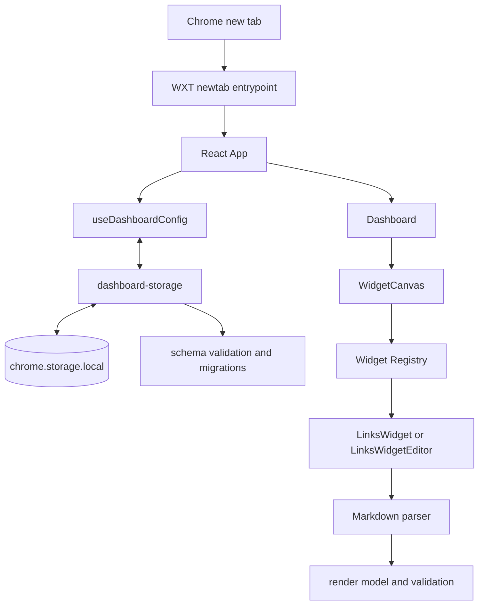

# Архитектура Chrome Start Page

Документ описывает MVP версии 0.1.0 и фактические границы модулей проекта.

## Общий поток



`DashboardConfig` движется между UI и storage как единый типизированный объект.
Компоненты не обращаются к Chrome API напрямую, а storage не зависит от React.

## WXT newtab entrypoint

`entrypoints/newtab/index.html` и `main.tsx` образуют WXT entrypoint типа
`newtab`. WXT генерирует поле `chrome_url_overrides.newtab` в Manifest V3.
`main.tsx` подключает стили Tailwind и `react-grid-layout`, после чего монтирует
`App` в React Strict Mode.

Конфигурация manifest находится в `wxt.config.ts`: имя, версия, описание,
иконки и разрешения задаются в одном месте. Статические файлы из `public/`
копируются в extension build.

## App и Dashboard

`App` — composition root React-части. Он:

- получает конфигурацию через `useDashboardConfig`;
- разрешает тему `system` в `light` или `dark` через `useSystemDarkMode`;
- применяет тему к корневому элементу документа;
- передаёт данные и операции в `Dashboard`;
- показывает ошибку загрузки или сохранения с ролью `alert`.

`Dashboard` хранит только эфемерное UI-состояние: включён ли режим
редактирования и какой виджет сейчас редактируется. Persisted state остаётся в
`DashboardConfig`. `DashboardControls` управляет режимом редактирования,
добавлением виджета и appearance, а `WidgetCanvas` отвечает за размещение,
редактирование и удаление экземпляров виджетов.

## Модель конфигурации

Корневая схема определена в `storage/schema.ts`:

```ts
interface DashboardConfig {
  version: 1;
  widgets: WidgetConfig[];
  appearance: AppearanceConfig;
}
```

Каждый виджет расширяет `BaseWidgetConfig` с `id`, discriminant `type`,
необязательным `title` и `layout`. `WidgetConfigMap` связывает строковый тип с
конкретной конфигурацией:

```ts
interface WidgetConfigMap {
  links: LinksWidgetConfig;
}

type WidgetType = keyof WidgetConfigMap;
type WidgetConfig = WidgetConfigMap[WidgetType];
```

Такой подход формирует typed discriminated union без `any`. После добавления
нового свойства в `WidgetConfigMap` TypeScript проверяет места, работающие со
всеми типами виджетов.

## Widget Registry

`widgets/registry.tsx` связывает тип виджета с:

- metadata для диалога добавления;
- factory начальной конфигурации;
- runtime type guard;
- renderer;
- необязательным editor;
- правилом, разрешающим завершить редактирование.

UI получает доступные типы через `getAvailableWidgetDefinitions`, создаёт
экземпляр через `createWidgetConfig` и отображает его через найденный
definition. Неизвестный или некорректный тип не приводит к выполнению
произвольного компонента: registry возвращает `undefined` или `null`, а
`WidgetHost` показывает безопасный fallback.

## LinksWidget

`LinksWidgetConfig` добавляет к базовым полям строку `content`. Исходный
Markdown в `content` — единственный source of truth. Parsed links не
дублируются в storage, поэтому renderer и editor всегда работают с одним и тем
же пользовательским текстом.

`LinksWidgetEditor` редактирует заголовок и raw Markdown. Изменения виджета
сохраняются с debounce 300 мс; завершение редактирования и размонтирование
принудительно сбрасывают ожидающее сохранение. Если распознанная Markdown-ссылка
имеет некорректный URL, editor показывает позицию ошибки и не позволяет
завершить редактирование.

`LinksWidget` отображает обычный текст и native `<a>` для валидных ссылок.
Ссылки открываются в текущей вкладке. `LinkFavicon` использует локальный
`_favicon` endpoint Chrome и заменяет недоступную favicon встроенной иконкой.

## Parser, render model и validation

`parseLinksContent` выполняет один проход по строкам и преобразует распознанные
конструкции `[label](url)` в модель, независимую от React:

```text
Markdown content
  -> LinksRenderLine[]
  -> text | link | invalid-link segments
  + LinksValidationResult
```

Переносы и пустые строки сохраняются как логические строки render model.
Нераспознанный Markdown и HTML-подобный ввод остаются текстом и экранируются
React при рендеринге.

`normalizeLinkUrl` отделён от parser. Он:

- принимает только HTTP и HTTPS;
- добавляет `https://` к однозначному hostname;
- отклоняет пустые, неоднозначные и содержащие пробелы URL;
- блокирует `javascript:`, `data:` и другие неподдерживаемые схемы.

Результат validation содержит reason, строку и столбец. Одна и та же функция
используется для preview, ошибок editor и проверки возможности завершить
редактирование.

## Storage, версия и migrations

`storage/dashboard-storage.ts` — единственная точка чтения и записи persisted
конфигурации. Она использует WXT Storage item
`local:dashboard-config`, который соответствует `chrome.storage.local`.
Прямых обращений UI к `chrome.storage` и `localStorage` нет.

Storage намеренно читает значение как `unknown` и передаёт его в
`migrateDashboardConfig`. Текущая версия схемы — `1`. Migration layer сначала
проверяет наличие поддерживаемой версии, затем всю структуру, включая типы
виджетов, appearance и числовые поля layout. Некорректные и будущие
неподдерживаемые версии дают явные ошибки, а не частично загруженное состояние.

При появлении версии 2 в `migrations.ts` следует добавить последовательное
преобразование `v1 -> v2`, валидировать результат и сохранять мигрированную
конфигурацию обратно. Номер `DASHBOARD_CONFIG_VERSION` меняется только вместе с
таким преобразованием.

`useDashboardConfig` держит актуальную конфигурацию в React state и ref, чтобы
операции не теряли предыдущие изменения. Добавление, удаление, appearance и
завершённый layout сохраняются сразу. Частые изменения editor объединяются
debounce-механизмом. Записи выстраиваются в очередь, поэтому более медленная
предыдущая операция не перезаписывает более новое состояние.

## Layout persistence

В storage layout представлен числами `x`, `y`, `w`, `h`. Чистые функции в
`components/dashboard/dashboard-layout.ts` нормализуют значения и преобразуют
их между domain config и форматом `react-grid-layout`.

Сетка содержит 12 колонок, минимальный размер виджета — 3×3, высота строки —
48 px. `WidgetCanvas` разрешает drag и resize только в режиме редактирования и
сохраняет layout после `onDragStop` или `onResizeStop`, а не на каждом событии
движения. При ширине окна менее 960 px остаётся desktop-canvas с горизонтальной
прокруткой; persisted coordinates не перестраиваются.

## Appearance

`AppearanceConfig` содержит:

```ts
interface AppearanceConfig {
  theme: 'system' | 'light' | 'dark';
  backgroundColor: string;
}
```

Значения сохраняются в том же `DashboardConfig`. System theme вычисляется по
`prefers-color-scheme`, а выбранный background применяется inline к корневому
контейнеру. Поэтому цвет не зависит от набора заранее сгенерированных Tailwind
классов.

## Как добавить новый тип виджета

1. Создать каталог `widgets/<type>/` с типом конфигурации, defaults, renderer и,
   если нужно, editor/domain logic.
2. Расширить `WidgetConfigMap` в `storage/schema.ts`. Значение поля `type`
   должно быть уникальным литералом.
3. Добавить runtime validation нового config в `storage/migrations.ts`, чтобы
   данные из storage не принимались только на основании TypeScript-типа.
4. Добавить factory, runtime type guard и definition в
   `widgets/registry.tsx`.
5. Если schema persisted-данных изменилась несовместимо, увеличить версию и
   добавить миграцию со старой версии.
6. Покрыть factory, validation, renderer/editor и save/load сценарии тестами.

Dashboard и диалог добавления не должны импортировать реализацию нового
виджета напрямую: интеграция проходит через registry и `WidgetConfig`.

## Почему слои разделены

- **UI** управляет взаимодействием, focus и временным состоянием, но не знает
  деталей Chrome storage.
- **Storage** отвечает за persistence, version boundary и порядок записей, но
  не зависит от React-компонентов.
- **Domain types и registry** задают допустимые конфигурации и связывают тип с
  реализацией без ветвлений по всему Dashboard.
- **Parser и validation** — чистые функции без DOM, React и browser API; их
  можно тестировать быстро и детерминированно.
- **Layout helpers** изолируют правила сетки от `react-grid-layout` callbacks и
  сохраняют domain-модель стабильной.

Разделение уменьшает область изменений: новый синтаксис ссылки не требует
правки storage, новый widget не меняет layout engine, а смена механизма
хранения не затрагивает parser или renderer.
